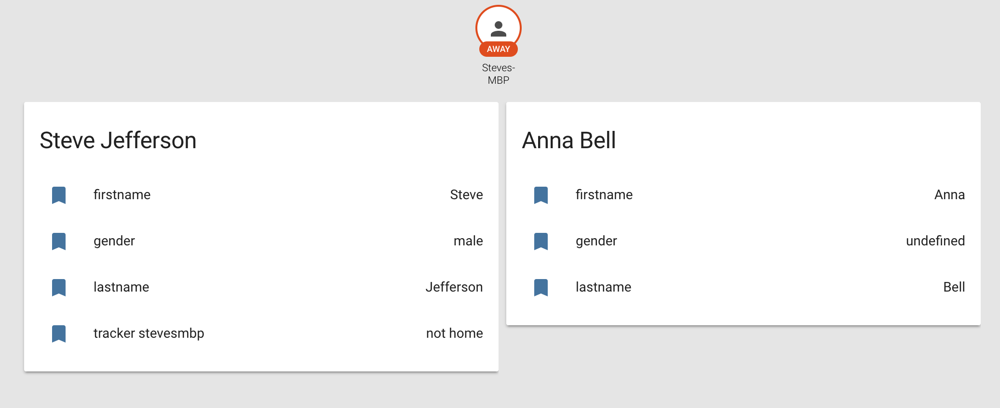

# Person Component

The Person Component is a custom component for [Home-Assistant](https://home-assistant.io).


# About / Why support this component?

This components will allow functions like:
- Better assignment of devices to persons. (Multiple trackers)
- Relationships between persons. ("Where is my wife?", "When do my kids get home?")
- Different user-accounts for home-assistant with different `configuration.yaml` for each person/group.
- Owning of objects. ("Turn on **my** TV.")


# Installation

1. Copy the `person.py`-file from this repository and paste it under `{YOUR_HOME_ASSISTANT_CONFIGURATION}/custom_components/`.
2. Add the persons to your `configuration.yaml`: 
```yaml
person:
  - firstname: Steve
    lastname: Jefferson
    gender: male
    relationships:
      - person: person.anna_bell
        relation: WIFE
    device_trackers:
      - device_tracker.stevesmbp

  - firstname: Anna
    lastname: Bell
```
3. Restart Home-Assistant.
It should now look like this:




# Current problems

- The device_trackers might not be loaded when the component loads.
